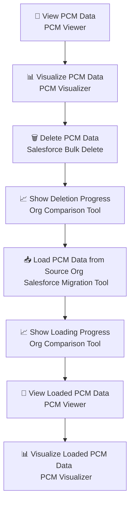
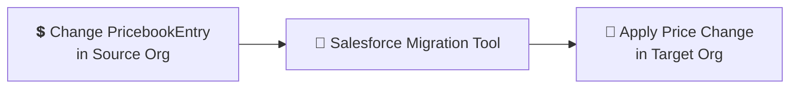

## Agenda
### Tools for the trade — quick tour of tools 
### Use Case 1 — PCM data refresh
### Use Case 2 — Price change propagation

---

## 🛠 Tools for the Trade (1/3)

### 🎯 **PCM Visualizer**
- 📊 Visualizes the **PCM structure** interactively.

### 🔍 **PCM Viewer with Kovai (LLMs)**
- 🗂 View & search **products in catalogs**.

### 🔄 **Salesforce Org Comparison Tool**
- 📈 Compare **data between two Salesforce orgs** with interactive charts.

### 🗑 **Salesforce Bulk Delete**
- 🧹 Bulk delete **PCM data** quickly and efficiently.

---

## 🛠 Tools for the Trade (2/3)

### 🧠 **SFQ**
- ⚡ Advanced **SOQL Query Editor** with:
  - 🚚 Bulk API Data Load
  - 🌐 REST Console
  - 📊 Data Visualization

### 📦 **Salesforce Migration Tool**
- 🔗 Seamlessly **migrate data between Salesforce orgs**.

### 📦 **Load Plan Load Plan Visualizer**
- 🔗 Upload and visualize your JSON load plan with interactive diagrams
- [Load Plan Load Plan Visualizer](https://mchinnappan100.github.io/pages2/tools/load-plan/)

## 🛠 Tools for the Trade (3/3)

###  📦 **REST - API Tester**
- 🔗 Test your APIs like PCM Connect API

###  📦 **Local Catalog Query Tool**
- 🔗 Test your APIs like PCM Connect API
- [Local Catalog Query](https://mchinnappan100.github.io/pages2/tools/smt/localcatalog.html)

---

## 💡 Use Case 1 — **PCM Data Refresh**

1. 👀 **View PCM Data** using **PCM Viewer**.
2. 📊 **Visualize PCM Data** using **PCM Visualizer**.
3. 🗑 **Delete existing PCM Data** in the org — show progress in **Org Comparison Tool**.
4. 📥 **Load PCM Data** from source org using **Salesforce Migration Tool** — show loading progress in Org Comparison Tool.
5. 👀 **View loaded data** with **PCM Viewer**.
6. 📈 **Visualize loaded data** with **PCM Visualizer**.

---
## Flow for Use Case - 1

---

## 💡 Use Case 2 — **Price Change Propagation**

1. 💲 Make a price change (`PricebookEntry`) in the source org.
2. 🔁 Use **Salesforce Migration Tool** to propagate the change into the target org.

---

## Flow for Use Case - 2 

